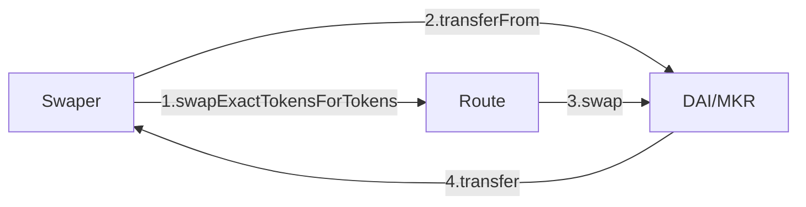
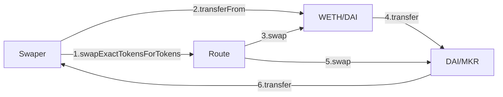

# UniSwap

恒定积公式（CPMM）

L 意思是 **L = Liquidity Token（流动性代币）**

$x \times y = L^2$

$L$ 越大, 获得的价格, Swap 的数量越好。

### 我们尝试进行交换

我们使用指定数量的 dx 去在AMM 中进行交换, 我们来逐步看看交换过程

$$
(x_0+d_x) \times (y_0-d_y) = L^2
\\
\\
x_0 \times y_0 = L^2
\\
\\
换元, 得:
\\
\\
(x_0 + d_x) \times ( y_0 - d_y ) = x_0 \times y_0
\\
\\
y_0 - d_y = \frac{ x_0y_0 } { x_0 + d_x }
\\
\\
d_y = y_0 - \frac{ x_0y_0 } { x_0 + d_x }
\\
\\
d_y = \frac{y_0(x_0 + d_x)}{x_0 + d_x} - \frac{ x_0y_0 } { x_0 + d_x }
\\
\\
dy = \frac{y_0x_0 + y_0d_x}{x_0 + d_x} - \frac{ x_0y_0 } { x_0 + d_x }
\\
\\
d_y = \frac{y_0x_0 + y_0d_x - x_0y_0 } { x_0 + d_x }
\\
\\
d_y = \frac{d_xy_0} { x_0 + d_x }
$$

OK, 如果没有交易手续费, 那么交换所得的 **$d_y$ 便是 $\frac{d_xy_0} { x_0 + d_x }$**

那创建池子的人肯定要赚钱呀, 怎么赚钱, 那么万变不离其宗：

**_此山是我开, 此树是我栽, 要想过此路, 留下买路财_**

买路财在这里便是收手续费, 在 uniswap 中 , 简称为 fee。这个手续费的**费率**我们叫做 $f$ ,
$f \in [0,1]$

这个手续费是交换发起方付的, 那么付的自然是 x 对应的 token。

在交换过程中消耗的 费用 便是 $f \times d_x$

所以实际进行交换的部分则是 $d_x - f*d_x$ 化简得 $d_x(1-f)$

我们带入到 $d_y = \frac{d_xy_0} { x_0 + d_x }$ 则是 $d_y = \frac{y_0d_x(1-f)} { x_0 + d_x(1-f)}$

同样的, 已知 $d_y$ 求 $d_x$

$$
d_y = \frac{y_0d_x(1-f)} { x_0 + d_x(1-f)}
\\
\\
d_y = \frac{y_0(1-f)}{\frac{x_0}{d_x}+(1-f)}
\\
\\
\frac{d_yx_0}{d_x}+d_y(1-f) = y_0(1-f)
\\
\\
\frac{d_yx_0}{d_x} = (y_0-d_y)(1-f)
\\
\\
d_x = \frac{d_yx_0}{ (y_0-d_y)(1-f)}
$$

上面的方法是其中一种, $d_x$ 可以互相求解 $d_y$, 我们称之为计算思路一。

下面我们介绍计算思路二。

我们也可以回归到公式的本质, 在AMM图像或者实际交换中, 我们付出的 $d_x$ 实际上就是 $d_x(1-f)$

$$
(x_0+d_x(1-f)) \times (y_0-d_y) = L^2
\\
\\
x_0 \times y_0 = L^2
\\
\\
(x_0+d_x(1-f)) \times (y_0-d_y) = x_0 \times y_0
$$

也是易得以上两解：

$$
d_y = \frac{y_0d_x(1-f)} { x_0 + d_x(1-f)}
\\
\\
d_x = \frac{d_yx_0}{ (y_0-d_y)(1-f)}
$$

这便是 UniSwap V2 的 计算公式。

### Swap 调用

我们知道 在Uniswap V2 中有 Route 合约, 我们来看看在实际中是怎么运行的吧

如果我们 ERC 20 交换 ERC 20 , 那么调用的则是 `swapExactTokensForTokens()` ；如果是ETH 交换 ERC20
, 那么是 `swapExactEthForTokens`, 这里我们就用 ERC20-DAI/MKR表示。

上面演示的是 1个交易对, 那么如果我们想要交换的这两个Token 之间路由不存在呢？

我们来看 UniSwap
