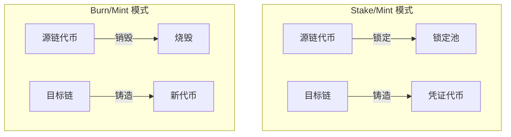
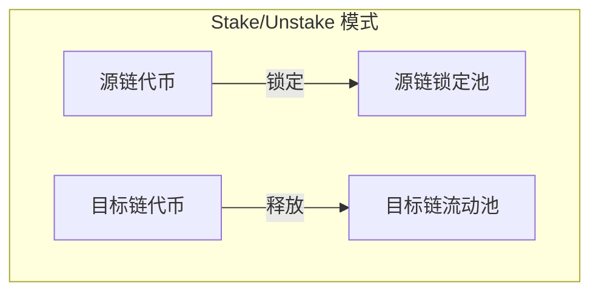
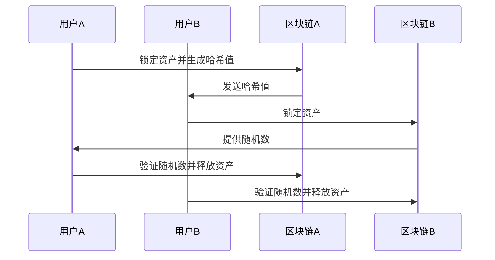

## 跨链的出现

当下公链生态呈现爆炸式增长，从以太坊扩容方案（Rollups）到 Solana、Avalanche 等高性能链，区块链世界逐渐形成"多链宇宙"。但每条链都像一座孤岛：协议互不兼容、资产无法互通、数据难以共享。Chainlink 曾将区块链比作不同大陆——即便某条链能建起摩天大楼，若没有跨海大桥连接其他大陆，生态价值终将受限。与此同时，DeFi、NFT、GameFi 的爆发式创新，迫使资金需要在各链间高效流转，跨链的需求已成必然。

## 什么是跨链？
简言之，**将链A的信息（资产/数据/状态）传递到链B的过程即为跨链**。这种价值转移不是简单的复制粘贴，而是通过特定协议确保信息在异构链间的可信流通。

## 跨链实践
如果你是一个一级玩家，假设现在 SOL 新出了一个土狗。你的钱大部分都放在 BSC 上，行情紧急，你想要把钱从 BSC 转到 SOL 上，怎么做？

如果现在你不知道现有的跨链工具，你会怎么做？

时间紧急，再不买就拉飞了，怎么办？仔细想想，再往下看...

非常简单的一种方法，找朋友，如果朋友 Solana 上正好有。你把 Arb 上的 U 打给他。他把 Solana 上的 SOL 打给你。

**恭喜！你已手动完成了跨链操作**，这就是跨链操作的本质，现实中的产品只不过多了亿点点东西。

我们大概可以知道为什么需要跨链了，我们来看看 chainlink 是怎么解读的：

>区块链之间无法天然通信——它们通常无法监控或理解其他网络上发生的事情。每个区块链在协议设计、货币、编程语言、治理结构、文化等方面都有自己的规则，这使得链间通信变得困难。这种区块链间通信的缺乏限制了Web3生态系统中经济活动的规模——没有区块链互操作性，不同的网络实际上是相互隔离的独立经济体，彼此之间没有连接。

>理解跨链桥需求的一个简单方法是将区块链想象成不同的大陆，之间隔着广阔的海洋。大陆A拥有丰富的自然资源，大陆B有肥沃的土地适合种植粮食，大陆C则拥有蓬勃发展的制造业和众多熟练的工匠。

>如果我们能够结合这些大陆的能力，就能创造一个繁荣的世界。但如果没有通过航运、桥梁、隧道或其他基础设施连接它们的经济，这些地区将无法从彼此的能力中获益。大陆A会缺乏食物，大陆B没有技术来最大化粮食生产效率，大陆C则没有资源制造最优质的产品。然而，如果我们能连接这些经济体，所有大陆都将受益于一个更加互联的世界，每个地区可以专注于自己的独特优势，同时通过贸易享受整个世界的财富和创造力。

>同样，通过使不同的区块链、扩展解决方案和特定应用链能够通信，整个生态系统可以从每个区块链生态系统的独特特质中获益。

如果还有疑问，可以先问问 [grok](), [deepseek](), [claude](), [豆包]() ...
当然我们也欢迎你加入我们的社群 [hyperlane 中文交流群]()

## 什么是跨链桥

想象一下这个场景：你在ETH上有资产，但想参与Solana生态的一个新项目。这两条链就像分隔在不同海域的岛屿，你需要一座桥来连接它们。这就是跨链桥的作用。

跨链桥本质上是一套让不同区块链之间实现价值传递的协议和工具。在多链宇宙中，它解决了最核心的互操作性问题。

当我说"跨链"，并不是真的把你的ETH物理搬到了Solana上，这在技术上是不可能的。实际发生的是这样：

1. 你在源链（比如ETH）上锁定了资产
2. 跨链桥检测到这一操作
3. 在目标链（比如Solana）上，桥为你铸造等值的代币凭证

这个过程中，几个关键角色至关重要：

- **检测者**：可以是验证者、中继或预言机，负责观察链上状态并传递信息
- **共识机制**：验证者如何就跨链消息达成一致？多签还是MPC门限签名？
- **奖惩机制**：如何激励验证者诚实行事？有些桥分享交易费，有些要求质押代币作为安全保证

跨链桥处理用户资产的方式也各不相同。有些桥由验证者直接托管资产，有些则通过智能合约管理，还有些利用链上流动性池实现无需托管的资产跨链。

从本质上讲，跨链并非转移资产本身，而是转移资产代表的价值。就像你在银行存美元换取日元时，美元并没有"飞"到日本，而是价值的等价交换。

这就是为什么跨链桥成为了多链生态中不可或缺的基础设施，让价值能够自由流动，打破区块链世界的孤岛效应。

## 跨链桥分类

如果按照中心化程度分类，可以分为以下两类：

1. **中心化跨链桥**
   - 需要信任中间机构
   - 我们通过朋友、交易所作为中介进行跨链就是最为中心化的操作，你必须对朋友/交易所保持信任
   - 优点：用户体验好，交易速度快，几乎适用于所有链
   - 缺点：存在单点故障风险，可能面临监管压力，中心化机构可能滥用权力
   - 实际案例：我们找朋友进行跨链转账，币安跨链、火币跨链等中心化交易所提供的跨链服务。
   
2. **去中心化跨链桥**
   - 零信任或最小信任架构
   - 通过智能合约、多签验证、密码学证明和经济激励机制保证安全
   - 优点：符合区块链去中心化精神，无需信任第三方，抗审查
   - 缺点：用户体验较差，交易确认时间长，成本可能更高
   - 分类：可进一步分为完全去中心化（如原子互换）和半中心化（如多签托管）
   - 实际案例：Portal Bridge、Connext、Hop Protocol等

两种跨链桥各有优缺点，在实际应用中往往需要在中心化和去中心化之间做权衡。高价值资产跨链时，用户通常会优先选择去中心化跨链方案；而对于小额、频繁的跨链需求，中心化方案因其便捷性可能更受欢迎。

如果按照跨链原理分类，可以分为一下两类

一. 锁仓/销毁+铸造类

1. Burn/Mint：在源链上销毁（burn）代币，然后在目标链上创建（mint）同等数量的代币。此方法好处是代币的总供应量保持不变，但是需要跨链桥拥有代币的铸造权限，适合项目方搭建自己的跨链桥。
    
    - **优点**：
        - 总代币供应量保持恒定
        - 实现逻辑相对简单
        - 无需维护大量资金池
    - **缺点**：
        - 需要项目方拥有铸造权限
        - 中心化程度较高
        - 适用场景有限
    
2. Stake/Mint：在源链上锁定（stake）代币，然后在目标链上创建（mint）同等数量的代币（凭证）。源链上的代币被锁定，当代币从目标链移回源链时再解锁。这是一般跨链桥使用的方案，不需要任何权限，但是风险也较大，当源链的资产被黑客攻击时，目标链上的凭证将变为空气。
    
    - **优点**：
      - 无需特殊权限
      - 实现门槛低
      - 流动性要求较低
    - **缺点**：
      - 安全风险较高
      - 源链资产被攻击会影响目标链代币价值
      - 需要完善的安全审计机制

二. 流动性池类

- Stake/Unstake：在源链上锁定（stake）代币，然后在目标链上释放（unstake）同等数量的代币，在目标链上的代币可以随时兑换回源链的代币。这个方法需要跨链桥在两条链都有锁定的代币，门槛较高，一般需要激励用户在跨链桥锁仓。
    

三. 原子置换类
- HTLC(哈希时间锁定合约)：一种通过哈希锁和时间锁结合，实现在不同区块链之间安全可信地交换资产的技术方案。

- **工作原理**：
  - 哈希锁：用户A创建随机数并将其哈希值作为"锁"，只有知道原始随机数才能解锁。
  - 时间锁：设定时间限制，如果在规定时间内交易未完成，资产将自动返回原所有者。
  
- **优点**：
  - 无需信任第三方，实现真正的去中心化跨链
  - 原子性保证，交易要么完全成功要么完全失败
  - 安全性高，资产不会被锁定在中间状态
  
- **缺点**：
  - 交易流程较复杂
  - 需要两条链都支持相关功能
  - 时间锁设置需谨慎考虑

按照服务目的分类：
1. 专注于做资产跨链的
2. 做某两条链之间的跨链
3. 专注于应用的跨链
4. 普适性的跨链桥

如果跨链技术分类 
1. Notary/公证人
2. Optimistic/ ZK 
3. HTLC

---

`todo: 持续更新`

## 跨链桥产品
我们来看 [defilama](https://defillama.com/bridges)

### LayerZero

### Hyperliquid

### Wormhole

### Hyperlane

### Debridge

## 参考
1. https://www.chainalysis.com/blog/introduction-to-cross-chain-bridges
2. https://www.hellobtc.com/kp/du/08/5353.html
3. https://blog.chain.link/cross-chain-zh/#post-title
4. https://www.aicoin.com/zh-Hans/article/316353
5. https://github.com/AmazingAng/WTF-Solidity/tree/main/54_CrossChainBridge
6. https://medium.com/coinmonks/cross-chain-bridges-101-how-do-tokens-flow-between-blockchains-fd3615a879fb
7. https://blog.dodoex.io/%E8%B7%A8%E9%93%BE%E6%BC%AB%E8%B0%88-%E8%B7%A8%E9%93%BE%E8%81%9A%E5%90%88%E5%99%A8%E7%9A%84%E5%B7%AE%E5%BC%82%E5%8C%96%E7%AB%9E%E4%BA%89-7c6fb8d72d1
8. https://mirror.xyz/iamdk.eth/WG5lsS0Cio-1Fgpd3cGA2T6l4tU4RpwRaakglyaN2wM
9. https://learnblockchain.cn/article/1553
10. https://www.aicoin.com/zh-Hans/article/316353#heading_0
11. https://dodotopia.notion.site/16-d849151423074cf59751545a8c0b6dc7
12. https://mirror.xyz/0xA26Aa9644d7418f023cA776BEECBCbd2863Da9D4/Ff5PfHeYyfInjaPXmSN5AK9AXWsB1Y-xrQP8yjZ2wXM
13. https://andrecronje.medium.com/multichain-dapp-guide-standards-and-best-practices-8fabe2672c60
14. https://www.youtube.com/watch?v=4QHflfHMga0

